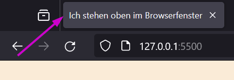

= HTML (HyperTextMarkupLanguage)

- Struktur der Seite
- Inhalt

== Head

- Informationen für den Browser wie er die Seite anzeigen soll
- enthält keine Infos für den Inhalt der Seite selber
- im folgenden wird zum Beispiel der Fenstertitel definiert

[source,html]
----
<head>
    <title>Ich stehen oben im Browserfenster</title>
</head>
----
// add image title.png

== Tags

- in HTML werden Inhalte durch Tags definiert
- Tags beginnen mit `<` und werden mit `>` geschlossen (z.B. `<body>`)
- die meisten Tags müssen wieder geschlossen werden durch ein weiteren Tag (z.B. `</body>`) geschlossen werden, es gibt aber auch Tags die sich selber schließen (z.B. ``)
- zwischen diese kann man Informationen schreiben

[cols="1,1,3", options="header"]
|===
| Tag | Bedeutung | Beispiel
|`<html>`...`</html>` | HyperTextMarkupLanguage | Wird am Anfang geöffnet und am Ende geschlossen und grenzt den Inhalt der Seite ab.
|`<head>`...`</head>` | Informationskopf | Enthält Informationen für den Browser wie er die Seite anzeigen soll. Enthält keine Infos für den Inhalt der Seite selber. 
|`<title>`...`</title>` | Titel | Definiert den Titel der Seite, der im Browserfenster angezeigt wird.
|`<body>`...`</body>` | Inhalt | Enthält den Inhalt der Seite.
|`<h1>`...`</h1>` | Header1 | Definiert eine Überschrift.
|`<h2>`...`</h2>` | Header2 | Definiert eine Unterüberschrift.
|`
`...`
` | Paragraph | Definiert einen Absatz.
|`<a>`...`</a>` | Anchor | Definiert einen Link.
|`
`...`
` | Division | Definiert eine Abschnitt.
|`` | Image | Definiert ein Bild.
|`<ul>`...`</ul>` | Unordered List | Definiert Stichpunkte.
|`<ol>`...`</ol>` | Ordered List | Definiert Nummerierte Stichpunkte.
|`<li>`...`</li>` | List Item | Definiert einen Stichpunkt.
|`<table>`...`</table>` | Tabelle | Definiert eine Tabelle.
|`<tr>`...`</tr>` | Table Row | Definiert eine Tabellenzeile.
|`<th>`...`</th>` | Table Header | Definiert eine Tabellenüberschrift.
|`<td>`...`</td>` | Table Data | Definiert eine Tabellenzelle.
|``...`` | Span | Definiert einen Textabschnitt.
|` ` | Break | Fügt einen Zeilenumbruch ein.
|`
` | Horizontal Rule | Fügt eine horizontale Linie ein.
|===
